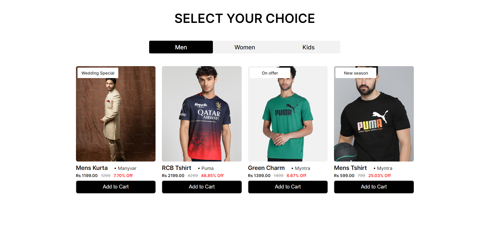

# Product Filter Project

A product filter project where users can filter products based on categories (men, women, and kids). The project is built using HTML, CSS, and JavaScript. Product data is dynamically fetched from an API, and the website is responsive across different devices.

## Demo

Check out the live demo [here](https://monumental-llama-92d507.netlify.app/).

## Screenshots

### Desktop View


### Tablet View


### Mobile View


## Features

- Filter products by categories: men, women, and kids.
- Dynamically created product cards based on the user's selection.
- Responsive design for mobile, tablet, and desktop.

## Installation

To run the project locally, follow these steps:

1. Clone the repository:

   ```bash
   git clone https://github.com/sargunkohli152/MarmetoProject-Product_Filter.git
   ```

2. Navigate to the project directory:
   
   ```bash
   cd MarmetoProject-Product_Filter
   ```

3. Open index.html on your local machine 

## Usage

1. Open the live demo link: [Product Filter Project](https://monumental-llama-92d507.netlify.app/).
2. Choose a category (men, women, or kids) from the filters.
3. View the dynamically generated product cards based on your selection.

## Technologies Used

- HTML
- CSS
- JavaScript

## Responsive Design
The project is designed to be responsive across different devices:

- Mobile (up to 767px width)
- Tablet (768px to 1024px width)
- Desktop (1025px and above width)

## Contributing
Contributions are welcome! Feel free to open issues or pull requests.

## License
This project is licensed under the MIT License.

